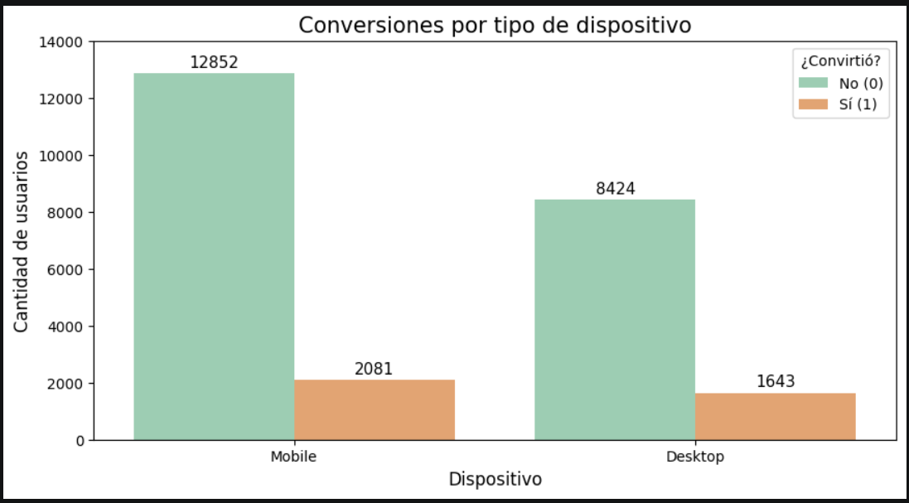
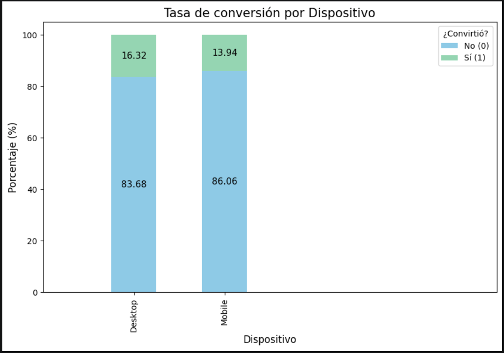
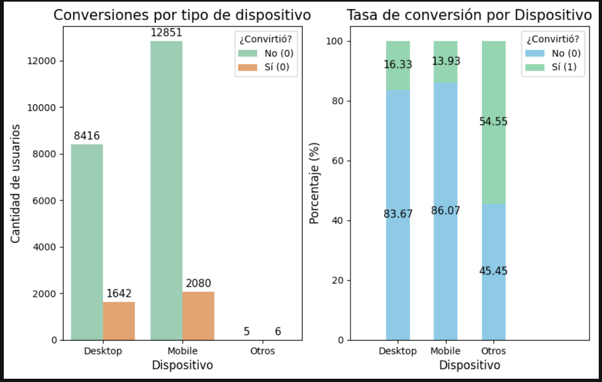

# A/B Testing Statistical Analysis for Landing Page Optimization
> Statistical evaluation of a synthetic A/B experiment to determine whether landing page version, device type, or region drive meaningful differences in conversion and spend.

---

## Table of Contents
1. [Executive Summary](#executive-summary)
2. [Business Storytelling (SCQA)](#business-storytelling-scqa)
3. [Project Objectives](#project-objectives)
4. [Tech Stack](#tech-stack)
5. [Dataset](#dataset)
6. [Project Workflow](#project-workflow)
7. [Repository Structure](#repository-structure)
8. [Key Visualizations](#key-visualizations)
9. [Key Insights (C→F→I)](#key-insights-cfi)
10. [Business Recommendations](#business-recommendations)
11. [How to Reproduce](#how-to-reproduce)
12. [Future Improvements](#future-improvements)
13. [Lessons Learned](#lessons-learned)
14. [Author](#author)

---

## Executive Summary
- **Problem:** A company launched two landing page versions (A and B) and needs to know whether one performs meaningfully better before committing to a full rollout.
- **Why it matters:** Even small differences in conversion rate and average spend translate directly into revenue and marketing ROI at scale.
- **What was built:** A complete hypothesis-testing pipeline — exploratory data analysis, two-sample t-tests, two-proportion z-tests, and chi-square tests of independence — applied across page version, device type, and region.
- **Business value:** The analysis identifies which page version and device segment to prioritize, and equally important, which segmentation variable (region) shows no statistical evidence and should **not** drive decisions.

---

## Business Storytelling (SCQA)
- **S (Situation):** 25,000 users were exposed to one of two landing page versions (A or B) across three regions (Norte, Centro, Sur) and multiple device types, with conversion, spend, and click behavior tracked per user.
- **C (Complication):** Initial inspection shows unequal conversion and spend patterns between page versions and devices, raising the question of whether these differences are real or attributable to sampling noise.
- **Q (Question):** Are the observed differences statistically significant enough to justify a page rollout decision, and do device or region moderate that effect?
- **A (Answer):** Page B significantly outperforms Page A in both conversion rate (16.70% vs. 13.07%) and average spend among converters ($65.68 vs. $55.54). Desktop users convert and engage more than Mobile users. Region shows no statistically significant association with conversion.

---

## Project Objectives

### General Objective
Determine, through rigorous statistical hypothesis testing, whether landing page version B outperforms version A, and identify the device and region segments where this effect is strongest.

### Specific Objectives
- Quantify differences in average spend between page versions using two-sample t-tests (with Levene's test to select Student's or Welch's variant).
- Quantify differences in click behavior by device, including a regional sub-segment, using t-tests.
- Compare conversion rates between page versions and device segments using two-proportion z-tests.
- Test the independence between device/region and conversion using chi-square tests, including a reliability check for low-frequency categories.

---

## Tech Stack
- Python
- Pandas
- SciPy
- Statsmodels
- Seaborn
- Matplotlib
- Jupyter Notebook
- Git
- GitHub

---

## Dataset

| Attribute | Description |
|-------------|-------------|
| Source      | Synthetic dataset generated for A/B testing practice |
| Records     | 25,000 users (main file) |
| Features    | `id_usuario`, `pagina`, `region`, `dispositivo`, `conversion`, `gasto`, `clics` |
| Time Period | Not applicable (synthetic, no timestamp) |
| Granularity | One row per user |

**Note on column names:** original column names are kept in Spanish (the business context and stakeholders are Spanish-speaking), consistent with the naming standard used across this portfolio.

**Data files:**

| File | Purpose |
|---|---|
| `landing-experiment-synthetic.csv` | Main dataset (25,000 records), `conversion` encoded as integer (0/1). Used for EDA, t-tests, and the primary chi-square test. |
| `landing-experiment-synthetic_2.csv` | Same population with `conversion` encoded as text (`Si`/`No`). Used to validate that the z-test methodology is robust to encoding format. |
| `landing-experiment-synthetic_3.csv` | Extended dataset including additional low-volume device categories (Smart TV, Smart Speaker). Used for the extended chi-square analysis and the region-conversion test. |

---

## Project Workflow

```text
Business Understanding → Data Understanding → Data Preparation
→ Hypothesis Testing (t-test, z-test, chi-square) → Business Insights → Recommendations
```

---

## Repository Structure

```text
landing-experiment-synthetic/
├── data/
│   └── raw/
│       ├── landing-experiment-synthetic.csv
│       ├── landing-experiment-synthetic_2.csv
│       └── landing-experiment-synthetic_3.csv
├── images/
│   ├── e1-grafico-de-barras-conversion-por-tipo-de-dispositivo.png
│   ├── e2-grafico-de-barras-tasa-de-conversion-por-dispositivo.png
│   └── e3-conversion-por-tipo-de-dispositivo-sin-excluir-otros.png
├── landing_experiment_synthetic.ipynb
├── README.md
├── requirements.txt
└── .gitignore
```

---

## Key Visualizations

### Conversions by Device Type

Absolute count of converted vs. non-converted users, grouped by device.

### Conversion Rate by Device

Normalized conversion rate (%) by device, isolating Desktop and Mobile.

### Device Conversion — All Categories Included

Conversion breakdown including low-volume device categories (Smart TV, Smart Speaker) prior to the reliability-based exclusion described in Key Insight 5.

---

## Key Insights (C→F→I)
> Each insight follows the **Cause → Finding → Impact/Action** chain, connecting statistical evidence with business decisions.

### Insight 1 — Page Version Drives Conversion
- **Cause:** Page B likely introduces UX, layout, or messaging differences relative to Page A.
- **Finding:** A two-proportion z-test shows Page B converts at 16.70% vs. Page A's 13.07% — a 3.63 percentage-point lift (p < 0.001). The result was independently confirmed using two different encodings of the conversion variable.
- **Impact / Recommended Action:** Prioritize Page B for broader rollout; pair this result with a projected revenue-lift estimate before committing engineering resources to a full migration.

### Insight 2 — Page Version Also Drives Spend Among Converters
- **Cause:** The same page-level differences that improve conversion appear to also influence purchase intent once a user converts.
- **Finding:** Among converting users, average spend on Page B ($65.68) is significantly higher than on Page A ($55.54) — a $10.14 difference (t-test, p < 0.001).
- **Impact / Recommended Action:** Evaluate page performance using both conversion rate *and* spend-per-converter, not conversion alone — Page B compounds gains on both dimensions.

### Insight 3 — Desktop Users Engage and Convert More Than Mobile
- **Cause:** Desktop's larger screen and typically more deliberate browsing context may support deeper on-page engagement.
- **Finding:** Desktop users register more clicks on average than Mobile users (60.83 vs. 54.97, Welch's t-test, p < 0.001) and convert at a higher rate (16.32% vs. 13.94% overall; 16.44% vs. 14.46% within the Norte region specifically) — despite Mobile bringing a larger volume of traffic.
- **Impact / Recommended Action:** Investigate Mobile UX friction points (load time, form design, checkout flow) to close the conversion gap and capture more value from the higher Mobile traffic volume.

### Insight 4 — Region Is Not a Meaningful Segmentation Variable
- **Cause:** None of the tested factors show a strong regional effect on conversion behavior in this dataset.
- **Finding:** A chi-square test of independence between region and conversion returns no statistically significant association (p = 0.115).
- **Impact / Recommended Action:** Deprioritize region-based segmentation for conversion-related decisions; concentrate optimization efforts on page version and device instead.

### Insight 5 — Small-Sample Categories Require Statistical Caution
- **Cause:** Alternative device categories (Smart TV, Smart Speaker) represent less than 0.1% of total traffic.
- **Finding:** A chi-square test including these categories initially failed the reliability criterion (37.5% of expected cell frequencies below 5). After regrouping them as "Others," the device-conversion association remained significant, but the apparently high conversion rate for "Others" (54.55%) is based on only 11 users and should not be treated as reliable evidence.
- **Impact / Recommended Action:** Exclude ultra-low-volume device categories from conversion-rate decision-making until sample size grows; flag them for monitoring only, not for action.

---

## Business Recommendations
- Roll out Page B as the default landing page experience, backed by statistically significant gains in both conversion rate and spend per converter.
- Prioritize a Mobile UX audit to close the conversion gap with Desktop, given Mobile's higher traffic share.
- Do not build region-based targeting logic around conversion — no statistical evidence supports it in this dataset.
- Monitor emerging device categories (Smart TV, Smart Speaker) but do not base decisions on them until sample size is sufficient for reliable testing.
- Pair this experiment's statistical significance with a business-impact estimate (e.g., projected revenue lift) before finalizing any rollout decision.

---

## How to Reproduce
1. Clone the repository:
   ```bash
   git clone https://github.com/JacoboGO/landing-experiment-synthetic.git
   ```
2. Create and activate a virtual environment.
3. Install dependencies:
   ```bash
   pip install -r requirements.txt
   ```
4. Open `landing_experiment_synthetic.ipynb` in Jupyter Notebook or VS Code.
5. **Update the `BASE_DIR` path** in the first code cell to match your local repository location (this is currently hardcoded and will be parameterized — see Future Improvements).
6. Run all cells top to bottom.

---

## Future Improvements
- Parameterize `BASE_DIR` using relative paths or an environment variable to remove the hardcoded local path and restore full reproducibility.
- Add effect size metrics (Cohen's d, relative uplift, confidence intervals) alongside p-values for each test.
- Modularize the testing functions (`prueba_estadistica_t`, `prueba_z_test`, `prueba_chi_cuadrado`) into a reusable `src/` package.
- Add an executive Power BI or Tableau dashboard summarizing the test results for non-technical stakeholders.
- Extend the analysis with a logistic regression model to evaluate device–region interaction effects on conversion.

---

## Lessons Learned
- **Technical:** Levene's test should always precede a t-test to correctly select between Student's and Welch's variants; the z-test for proportions gives consistent results regardless of whether the target variable is encoded as text or as a binary integer.
- **Business:** Statistical significance does not equal decision-readiness — effect size and projected revenue impact must accompany p-values before a business rollout decision is made.
- **Professional:** Small-sample categories can produce misleadingly extreme results (e.g., the "Others" device group). Always validate the chi-square reliability criterion (expected frequency ≥ 5 in at least 80% of cells) before trusting the output.

---

## Author

**Jacobo Galindo Ortiz**
Data Analyst Portfolio

[](https://www.linkedin.com/in/jacobo-galindo-ortiz)
[](https://github.com/JacoboGO)
[](https://public.tableau.com/app/profile/jacobo.galindo.ortiz/vizzes)
[](mailto:ing_j_g_ortiz@hotmail.com)

---

> *"Language is a window into the mind."*
> — Noam Chomsky

<div align="center">

⭐ If this project was useful to you, consider leaving a star
on the repository — it helps a lot and is greatly appreciated.

</div>

---

## Usage Notice

This repository is provided for portfolio and educational review purposes.

The project may be viewed to evaluate the analytical approach,
methodology, and implementation. It is not intended for redistribution,
commercial use, or incorporation into other projects without prior
written permission from the author.

If you would like to reference or discuss any part of this work,
please contact the author.
